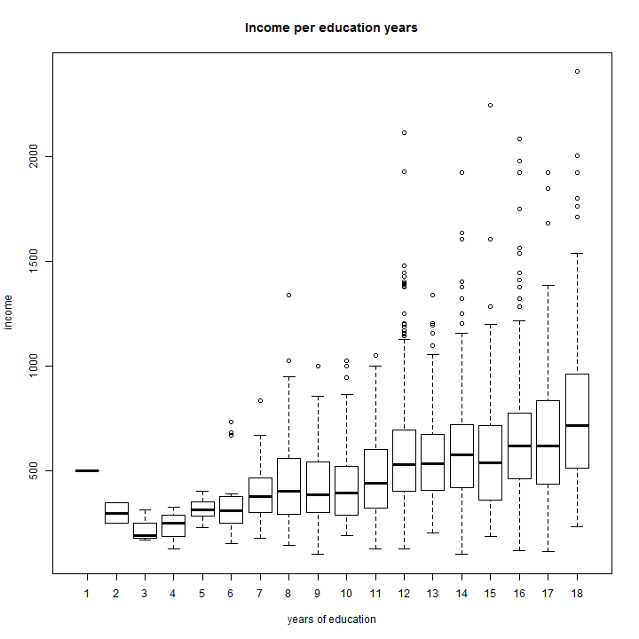
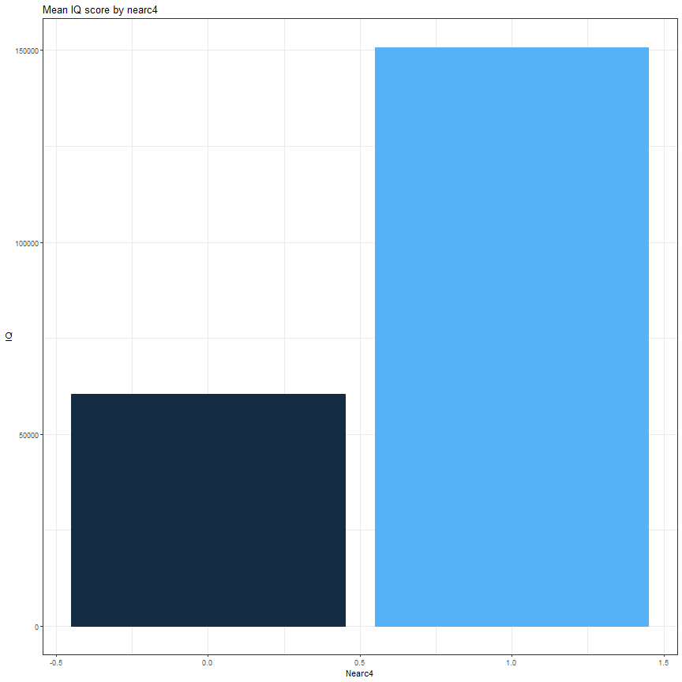

Uebung 4 EMPIWIFO
========================================================
author: Aurelien Sallin
date: May 2018
width: 1440
height: 900
font-family: 'Helvetica'


The Card dataset
========================================================


Estimation of returns to education. Sample from 1976.

Interesting use of "living close to a college" as an instrumental variable for education.

Motivation for instrument
========================================================
We want to estimate the following model: 

$$ \text{log(wage)} = \beta_0 + \beta_1 \text{education} + \beta_2 ability + u$$

but the problem is that ability is not observed. 

We could use a proxy variable (e.g. IQ) to measure. However, if there is no proxy for ability, we see that ability would be part of the error term (see slide 10 of course 8). In this case, the estimation of 

$$ \text{log(wage)} = \beta_0 + \beta_1 \text{education} + u$$

by OLS would be biased, and $\beta_1$ would be inconsistent. In this case, $Cov(educ, u) \neq 0$. We see that in our problem, the variable "educ" captures the effect of a variation in education as well as the effect of a variation in the unobserved ability.

Thus, we can use an instrument to disentangle these two effects and to isolate the effect in education due to pure education (and not due to the unobserved ability). 

Question 1: Conditions for a valid instrument
========================================================
There are two conditions a valid instrument $z$ must fulfill:

- **instrument exogeneity**: $z$ must have no partial effect on $y$ and $z$ must be uncorrelated with the omitted variable. Namely, **$Cov(z,u) = 0$**

  - This condition is called the **exclusion restriction**. It states that $z$ affects $y$ *only through* $x$: $z$ itself does not cause $y$.
 - In our case, we want an instrument which is not correlated with ability, and which affects the wage only through education (and not ability)!
 - The exclusion restriction is harder to test: it relies mainly on economic intuition and arguments.

- **instrument relevance**: $z$ must be somehow related with $x$. Namely, **$Cov(z,x) \neq 0$**

Question 1: Conditions for a valid instrument
========================================================
Show formally that if these assumptions are satisfied, the coefficient on the endogenous regressor is identified by the covariance of the instrument and the dependent variable over the covariance of the instrument and the endogenous regressor.

$$
\begin{align}
Cov(z,u) &= Cov(z, y-\beta_0 - \beta_1 x_1)\\
&=Cov(z,y) - Cov(z, \beta_0) - Cov(z,\beta_1x_1)\\
&=Cov(z,y) - 0 - Cov(z,\beta_1x_1)\\
&=Cov(z,y) - \beta_1Cov(z,x_1)\\
&=0\\
\\
\beta_1 &= \frac{Cov(z,y)}{Cov(y,x_1)}
\end{align}
$$
This does not work if the instrument relevance condition is not fulfilled (the denominator = 0). This allows us to identify $\beta_1$. Also, observe that, when $z = x$, we end up with the OLS estimation of $\beta_1$.

Question 2-3
========================================================
Assess whether a *random* distribution of school vouchers would fulfill the qualification for a valid instrument for education. 

- **instrument exogeneity**: random

- **instrument relevance**: costs of education are lower with a voucher.

Now, what about Card's argument that growing up in the proximity of a college lowers education costs, and thus can be used as an instrument for education? 

- **instrument exogeneity**: do people with higher ability live closer to a college? 

- **instrument relevance**: living closer to university allows students to pay less for accomodation.

Question 4 - Some descriptives
========================================================



Question 4 - Some descriptives
========================================================

```
[1] "Number of observations: 3010"
```


Summary stats for variables *lwage*, *educ*, *nearc4*:

```
     Lwage            Educ           Nearc4      
 Min.   :4.605   Min.   : 1.00   Min.   :0.0000  
 1st Qu.:5.977   1st Qu.:12.00   1st Qu.:0.0000  
 Median :6.287   Median :13.00   Median :1.0000  
 Mean   :6.262   Mean   :13.26   Mean   :0.6821  
 3rd Qu.:6.564   3rd Qu.:16.00   3rd Qu.:1.0000  
 Max.   :7.785   Max.   :18.00   Max.   :1.0000  
```


Question 4: Instrument relevance
========================================================
Test whether the instrument *nearc4* is correlated with education. We regress the education on the proximity to college.

```r
ols <- lm(educ~ nearc4, data = data) 
coeftest(ols, vcov = vcovHC(ols, type="HC1"))
```

```

t test of coefficients:

            Estimate Std. Error  t value  Pr(>|t|)    
(Intercept) 12.69801    0.09022 140.7451 < 2.2e-16 ***
nearc4       0.82902    0.10669   7.7701 1.068e-14 ***
---
Signif. codes:  0 '***' 0.001 '**' 0.01 '*' 0.05 '.' 0.1 ' ' 1
```

Are the two assumptions fulfilled here?


Question 4: Instrument relevance
========================================================
Why is this step relevant? You saw in the course the intuition for **2SLS**. Namely, we can isolate the part of *educ* which is uncorrelated with the error term (ability). In other words, using the OLS formula for the slope parameter, we have:

$$
\begin{align}
\text{educ} &= \pi_0 + \pi_1 \text{nearc4} + u \\
\\
\pi_1 &= \frac{Cov(nearc4, educ)}{Var(nearc4)}
\end{align}
$$


```r
cov(data$educ, data$nearc4)
```

```
[1] 0.179836
```

```r
var(data$nearc4)
```

```
[1] 0.2169263
```

```r
cov(data$educ, data$nearc4)/var(data$nearc4)
```

```
[1] 0.829019
```


Question 6: Instrument relevance: unconditional
========================================================

```r
ols1 <- lm(IQ~ nearc4, data = data) 
coeftest(ols1, vcov = vcovHC(ols1, type="HC1"))
```

```

t test of coefficients:

             Estimate Std. Error  t value  Pr(>|t|)    
(Intercept) 100.61065    0.63311 158.9162 < 2.2e-16 ***
nearc4        2.59620    0.74945   3.4641 0.0005428 ***
---
Signif. codes:  0 '***' 0.001 '**' 0.01 '*' 0.05 '.' 0.1 ' ' 1
```

========================================================

```r
gd <- data %>% 
        group_by(nearc4) %>% 
        summarise(IQ = mean(IQ))
```



Exercise 8: Conditional instrument validity
========================================================

```

t test of coefficients:

             Estimate Std. Error t value  Pr(>|t|)    
(Intercept) 104.77348    1.50529 69.6036 < 2.2e-16 ***
nearc4        0.34790    0.80789  0.4306 0.6667861    
smsa66        1.08917    0.79473  1.3705 0.1706840    
reg662        1.09928    1.55196  0.7083 0.4788286    
reg663       -1.55930    1.50944 -1.0330 0.3017135    
reg664       -0.54250    1.72368 -0.3147 0.7529958    
reg665       -8.47546    1.61946 -5.2335 1.833e-07 ***
reg666       -7.42117    1.93497 -3.8353 0.0001292 ***
reg667       -8.39441    1.79553 -4.6752 3.128e-06 ***
reg668       -2.92497    2.33813 -1.2510 0.2110808    
reg669       -2.89192    1.72239 -1.6790 0.0933016 .  
---
Signif. codes:  0 '***' 0.001 '**' 0.01 '*' 0.05 '.' 0.1 ' ' 1
```


Exercise 10: Conditional instrument validity
========================================================

```

Call:
lm(formula = educ ~ nearc4 + exper + expersq + black + smsa + 
    south + smsa66 + reg662 + reg663 + reg664 + reg665 + reg666 + 
    reg667 + reg668 + reg669, data = data)

Residuals:
   Min     1Q Median     3Q    Max 
-7.545 -1.370 -0.091  1.278  6.239 

Coefficients:
              Estimate Std. Error t value Pr(>|t|)    
(Intercept) 16.6382529  0.2406297  69.145  < 2e-16 ***
nearc4       0.3198989  0.0878638   3.641 0.000276 ***
exper       -0.4125334  0.0336996 -12.241  < 2e-16 ***
expersq      0.0008686  0.0016504   0.526 0.598728    
black       -0.9355287  0.0937348  -9.981  < 2e-16 ***
smsa         0.4021825  0.1048112   3.837 0.000127 ***
south       -0.0516126  0.1354284  -0.381 0.703152    
smsa66       0.0254805  0.1057692   0.241 0.809644    
reg662      -0.0786363  0.1871154  -0.420 0.674329    
reg663      -0.0279390  0.1833745  -0.152 0.878913    
reg664       0.1171820  0.2172531   0.539 0.589665    
reg665      -0.2726165  0.2184204  -1.248 0.212082    
reg666      -0.3028147  0.2370712  -1.277 0.201590    
reg667      -0.2168177  0.2343879  -0.925 0.355021    
reg668       0.5238914  0.2674749   1.959 0.050246 .  
reg669       0.2102710  0.2024568   1.039 0.299076    
---
Signif. codes:  0 '***' 0.001 '**' 0.01 '*' 0.05 '.' 0.1 ' ' 1

Residual standard error: 1.941 on 2994 degrees of freedom
Multiple R-squared:  0.4771,	Adjusted R-squared:  0.4745 
F-statistic: 182.1 on 15 and 2994 DF,  p-value: < 2.2e-16
```

Exercise 11: Comparison OLS-IV
========================================================

```

Call:
lm(formula = lwage ~ educ + exper + expersq + black + smsa + 
    south + smsa66 + reg662 + reg663 + reg664 + reg665 + reg666 + 
    reg667 + reg668 + reg669, data = data)

Residuals:
     Min       1Q   Median       3Q      Max 
-1.62326 -0.22141  0.02001  0.23932  1.33340 

Coefficients:
              Estimate Std. Error t value Pr(>|t|)    
(Intercept)  4.6208068  0.0742327  62.248  < 2e-16 ***
educ         0.0746933  0.0034983  21.351  < 2e-16 ***
exper        0.0848320  0.0066242  12.806  < 2e-16 ***
expersq     -0.0022870  0.0003166  -7.223 6.41e-13 ***
black       -0.1990123  0.0182483 -10.906  < 2e-16 ***
smsa         0.1363845  0.0201005   6.785 1.39e-11 ***
south       -0.1479550  0.0259799  -5.695 1.35e-08 ***
smsa66       0.0262417  0.0194477   1.349  0.17733    
reg662       0.0963672  0.0358979   2.684  0.00730 ** 
reg663       0.1445400  0.0351244   4.115 3.97e-05 ***
reg664       0.0550756  0.0416573   1.322  0.18623    
reg665       0.1280248  0.0418395   3.060  0.00223 ** 
reg666       0.1405174  0.0452469   3.106  0.00192 ** 
reg667       0.1179810  0.0448025   2.633  0.00850 ** 
reg668      -0.0564361  0.0512579  -1.101  0.27098    
reg669       0.1185698  0.0388301   3.054  0.00228 ** 
---
Signif. codes:  0 '***' 0.001 '**' 0.01 '*' 0.05 '.' 0.1 ' ' 1

Residual standard error: 0.3723 on 2994 degrees of freedom
Multiple R-squared:  0.2998,	Adjusted R-squared:  0.2963 
F-statistic: 85.48 on 15 and 2994 DF,  p-value: < 2.2e-16
```
========================================================

```

Call:
ivreg(formula = lwage ~ educ + exper + expersq + black + smsa + 
    south + smsa66 + reg662 + reg663 + reg664 + reg665 + reg666 + 
    reg667 + reg668 + reg669 | exper + expersq + black + smsa + 
    south + smsa66 + reg662 + reg663 + reg664 + reg665 + reg666 + 
    reg667 + reg668 + reg669 + nearc4, data = data)

Residuals:
     Min       1Q   Median       3Q      Max 
-1.83164 -0.24075  0.02428  0.25208  1.42760 

Coefficients:
              Estimate Std. Error t value Pr(>|t|)    
(Intercept)  3.6661509  0.9248295   3.964 7.54e-05 ***
educ         0.1315038  0.0549637   2.393  0.01679 *  
exper        0.1082711  0.0236586   4.576 4.92e-06 ***
expersq     -0.0023349  0.0003335  -7.001 3.12e-12 ***
black       -0.1467757  0.0538999  -2.723  0.00650 ** 
smsa         0.1118083  0.0316620   3.531  0.00042 ***
south       -0.1446715  0.0272846  -5.302 1.23e-07 ***
smsa66       0.0185311  0.0216086   0.858  0.39119    
reg662       0.1007678  0.0376857   2.674  0.00754 ** 
reg663       0.1482588  0.0368141   4.027 5.78e-05 ***
reg664       0.0498971  0.0437398   1.141  0.25406    
reg665       0.1462719  0.0470639   3.108  0.00190 ** 
reg666       0.1629029  0.0519096   3.138  0.00172 ** 
reg667       0.1345722  0.0494023   2.724  0.00649 ** 
reg668      -0.0830770  0.0593314  -1.400  0.16155    
reg669       0.1078142  0.0418137   2.578  0.00997 ** 

Diagnostic tests:
                  df1  df2 statistic  p-value    
Weak instruments    1 2994    13.256 0.000276 ***
Wu-Hausman          1 2993     1.168 0.279973    
Sargan              0   NA        NA       NA    
---
Signif. codes:  0 '***' 0.001 '**' 0.01 '*' 0.05 '.' 0.1 ' ' 1

Residual standard error: 0.3883 on 2994 degrees of freedom
Multiple R-Squared: 0.2382,	Adjusted R-squared: 0.2343 
Wald test: 51.01 on 15 and 2994 DF,  p-value: < 2.2e-16 
```

